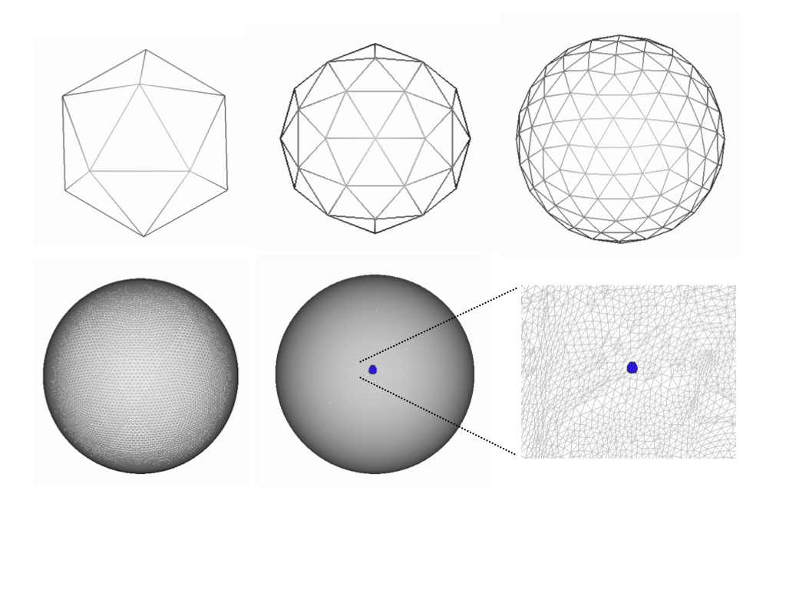

# New Multimodal Surface Matching - newMSM

newMSM (Multimodal Surface Matching) is a tool for registering cortical surfaces. The tool has been developed and tested using FreeSurfer extracted surfaces. However, in principle the tool with work with any cortical surface extraction method provided the surfaces can be mapped to the sphere. The key advantage of the method is that alignment may be driven using a wide variety of univariate (sulcal depth, curvature, myelin), multivariate (Task fMRI, or Resting State Networks) or multimodal (combinations of folding, myelin and fMRI) feature sets.

The main MSM tool is currently run from the command line using the program `newmsm`. This enables fast alignment of spherical cortical surfaces by utilising a fast discrete optimisation framework (FastPD: Komodakis 2007), which significantly reduces the search space of possible deformations for each vertex, and allows flexibility with regards to the choice of similarity metric used to match the images.

NewMSM is a new implementation with several improvements that made the MSM method computationally more efficient. Improvements include a completely re-implemented mesh resampling library with a new nearest neighbour search algorithm (octree search), an option for multicore CPU utilisation and several other improvements. In general, the average runtime of a registration process is now 25% of that of the original MSM implementation (and 5% using multicore CPU utilisation). The operation of newMSM is supposed to be the same as the previous MSM implementation. We notify the user about any changes that have been made in adequate command line messages. NewMSM now contains an implementation of a groupwise surface registration method that is described later in this guide. The original implementation can be found at https://github.com/ecr05/MSM_HOCR/

## Referencing

If you wish to use this tool, please reference our paper in any resulting publication.

> Emma C. Robinson, Saad Jbabdi, Matthew F. Glasser, Jesper Andersson, Gregory C. Burgess, Michael P. Harms, Stephen M. Smith, David C. Van Essen, Mark Jenkinson, MSM: A new flexible framework for Multimodal Surface Matching, NeuroImage, Volume 100, 2014, Pages 414-426, ISSN 1053-8119, https://doi.org/10.1016/j.neuroimage.2014.05.069.


> N. Komodakis and G. Tziritas, Approximate Labeling via Graph Cuts Based on Linear Programming, in IEEE Transactions on Pattern Analysis and Machine Intelligence, vol. 29, no. 8, pp. 1436-1453, Aug. 2007, https://doi.org/10.1109/TPAMI.2007.1061. 

For those using the HCP pipelines and/or newMSM with Higher Order Smoothness Constraints, please also reference:

> Emma C. Robinson, Kara Garcia, Matthew F. Glasser, Zhengdao Chen, Timothy S. Coalson, Antonios Makropoulos, Jelena Bozek, Robert Wright, Andreas Schuh, Matthew Webster, Jana Hutter, Anthony Price, Lucilio Cordero Grande, Emer Hughes, Nora Tusor, Philip V. Bayly, David C. Van Essen, Stephen M. Smith, A. David Edwards, Joseph Hajnal, Mark Jenkinson, Ben Glocker, Daniel Rueckert, Multimodal surface matching with higher-order smoothness constraints, NeuroImage, Volume 167, 2018, Pages 453-465, ISSN 1053-8119, https://doi.org/10.1016/j.neuroimage.2017.10.037.

> Ishikawa, Hiroshi. Higher-order clique reduction without auxiliary variables, In Proceedings of the IEEE Conference on Computer Vision and Pattern Recognition, pp. 1362-1369. 2014.

> Matthew F. Glasser, Stamatios N. Sotiropoulos, J. Anthony Wilson, Timothy S. Coalson, Bruce Fischl, Jesper L. Andersson, Junqian Xu, Saad Jbabdi, Matthew Webster, Jonathan R. Polimeni, David C. Van Essen, Mark Jenkinson, The minimal preprocessing pipelines for the Human Connectome Project, NeuroImage, Volume 80, 2013, Pages 105-124, ISSN 1053-8119, https://doi.org/10.1016/j.neuroimage.2013.04.127.

If you use the groupwise method, please also reference:

> Besenczi, R., Guo, Y., Robinson, E.C. (2024). High Performance Groupwise Cortical Surface Registration with Multimodal Surface Matching. In: Modat, M., Simpson, I., Špiclin, Ž., Bastiaansen, W., Hering, A., Mok, T.C.W. (eds) Biomedical Image Registration. WBIR 2024. Lecture Notes in Computer Science, vol 15249. Springer, Cham. https://doi.org/10.1007/978-3-031-73480-9_25

## Method fundamentals

As mentioned above MSM matches two spherical surfaces known as the input and reference. Registration is performed by warping a low resolution regular Control Point (CP) Grid. At each iteration of the registration, every control point is deformed independently according to one of a small set of local rotations. The endpoints of these rotations are defined by a set of evenly spaced points (labels) that surround the control point, which are determined by placing a higher resolution Sampling Grid over each CP. This warp is then propagated to the (higher resolution) input mesh using mesh interpolation.


Choice of label (and therefore local deformation) is dependent on the similarity of the input and reference mesh features following the proposed warp. Therefore, for each control point, an overlapping patch from the input mesh is transformed according to each local rotation, and its similarity with the reference features at that position is assessed. The optimal label choice balances the desire for optimal image matching with a requirement that the deformation should be as smooth as possible. Note, rather than using the full feature sets, data is typically downsampled and smoothed onto regular [template surfaces](#regular-mesh-surfaces) known as the datagrid as we find this speeds computation without appreciably downgrading the quality of the alignment.

An important characteristic of the MSM framework is that the registration is performed over a series of stages. The registration can be initialised using an affine alignment step that should be able to correct global transformation differences between images. It then proceeds over a series of discrete registration steps where the resolution of the control point grid (that warps the input surface) is increased at each stage. At each stage of the discrete registration the registration performs a series of iterations, where control points are deformed as described above. Thus the registration proceeds in a coarse to fine fashion, where if large deformations are required to align the two surfaces these will be corrected for in the early stages of the registration and the final steps are for alignment of fine detail. For more details please see our NeuroImage paper.

The number of faces in an icosahedron is 20 and subsampling this gives rise to high resolution representations of a sphere that are used for controlling the grid spacing. Serial subsampling leads to polyhedra with the following number of faces: 42, 162, 642, 2562, 10242, 40962. These correspond to the codes: 1, 2, 3, 4, 5, 6. Below are examples of codes 0 (icosahedron), 1 and 2 in the first row and 4 and 5 in the second row.



## The Human Connectome Project - visualisation software and file formats

The HCP consortium (http://www.humanconnectome.org/) provide a suite of surface processing and visualisation tools that can be used very effectively together with MSM. In particular these tools refine the FreeSurfer pipeline, and supply pipelines for directly mapping functional and diffusion data onto the surface. Surfaces are supplied in CIFTI and GIFTI formats and can be visualised using the very flexible HCP visualisation tool `wb_view`. Scripts for processing your data following the HCP pipeline can be found at http://www.humanconnectome.org/documentation/HCP-pipelines/. If your data does not conform to the HCP protocol, specifically you have no T2 or different task protocols, please contact the [FSL mailing list](support.md).


# Getting started

Prior to running MSM you will need to have passed your data through a surface extraction and inflation pipeline such as FreeSurfer, or the HCP minimal processing pipeline. This is because, if MSM is to work for your data you must have cortical surface meshes that have been mapped to the sphere. In addition, you will require a data file for each mesh, where the data may be scalar (such as sulcal depth, curvature or myelin features) or multivariate (RSNs or fMRI task maps).

Data can be supplied as GIFTI (`.func.gii` or `.shape.gii`), ASCII (`.asc`) files, or as a simple text file (with `.txt` extension) provided the text file has as many columns as there are mesh vertices. Surface files may be supplied as GIFTI (`surf.gii`) or ASCII (`.asc`). In general the key files required to run MSM are the:

 - **input mesh** - otherwise known as the "source" or "moving" mesh. This will be the mesh that is deformed during the registration.
 - **reference mesh** - otherwise the "target" or "fixed" mesh. This represents the surface you would like the source data to be deformed to most resemble. In some cases, for example if source and target data have both been resampled onto a population average surface (such as the HCP `FS_LR164k` or `FS_LR32k` average surface) it will be sufficient to just supply an input mesh.
 - **input data** - the data file associated with the input mesh. This must therefore have as many data points as there are surface mesh vertices.
 - **reference data** - the data file associated with the referenced mesh.

Examples of the most basic types of call to msm (using these inputs):

 - **Example A:**
   ```bash
   msm --inmesh=input_mesh.surf.gii \
       --refmesh=ref_mesh.surf.gii  \
       --indata=in_data.func.gii    \
       --refdata=ref_data.func.gii  \
       --out=~/mydirname/L.
   ```
 - **Example B:**
   ```bash
   msm --inmesh=average.sphere.FSLR32K.surf.gii \
       --indata=in_data.func.gii                \
       --refdata=ref_data.func.gii              \
       --out=~/mydirname/L.
   ```

Where this assumes you are calling msm from the directory where the data exists. The final option (`-o/--out`) is the stem of the path where you wish to output your data; we suggest `~/mydirname/L.` or `~/mydirname/R.` as an example of how you can input left and right hemisphere results into the same directory. Example B shows an example of how, when both datasets have been resampled to a population average surface (such as the HCP's 32k `FS_LR` surface), it is possible to enter just the average sphere as the input mesh.

The most relevant outputs of MSM are:

 - `~/mydirname/L.sphere.reg.surf.gii` - the warped input mesh (i.e., new vertex locations - this capture the warp field, much like a `*_warp.nii.gz` file would for volumetric warps created by FNIRT.

 - `~/mydirname/L.sphere.LR.reg.surf.gii` - this is a downsampled version of the above warp where the resolution of this mesh will be equivalent to the resolution of the final datamesh (see [configuration files](#configuration-files)). This can be used for warping new meshes through the transformation (see the [section on transformation](#transforming-unseen-data)).

 - `~/mydirname/L.transformed_and_reprojected.func.gii` - the input data passed through the MSM warp and projected onto the target surface (useful for vertex-wise comparison with the target).

where GIFTI outputs are used here only as examples. The program also supports output as ASCII and VTK using the command line option `-f`.

# Template spaces

For cortical surface alignment it is common practice to align to a population average template space. For adults there are two prominent examples: the FreeSurfer `fsaverage` mesh and the `FS_LR164k` and `FS_LR32k` spaces for the HCP. The `FS_LR164k` population average space is based upon `fsaverage` but has right and left vertex equivalence (it is symmetric). The `FS_LR32k` surface is a downsampled version of this for f/dMRI processing.

An important point to note about the HCP average space is that the process used to achieve symmetry generates a mesh space rotated with respect to the fsaverage and native mesh spaces. To account for this the HCP have introduced a rotated native sphere called `sphere.rot.native.surf.gii`. Therefore, by example for some subject `BOB` using HCP notation in directory `/path/to/mystudy/`:

 - `/path/to/mystudy/BOB/MNINonLinear/` - respresents files resampled to 164k average space

 - `/path/to/mystudy/BOB/MNINonLinear/fsaverage_LR32K/` - represents files resampled to the 32k average space;

 - `/path/to/mystudy/BOB/MNINonLinear/Native` - represents and all files relating to the subjects original 'native' mesh. In other words the meshes directly extracted from each subjects structural image.

In each subject's Native space there will be several spherical mesh representations. Using left as an example, these three meshes will be important for any further processing:

 - `/path/to/mystudy/BOB/MNINonLinear/Native/BOB.L.sphere.native.surf.gii` - this is the mesh obtained from projecting the subject's native white matter mesh to a sphere using FreeSurfer

 - `/path/to/mystudy/BOB/MNINonLinear/Native/BOB.L.sphere.rot.native.surf.gii` - this is the result of correcting for the rotation between the FS_LR and native spaces

 - `/path/to/mystudy/BOB/MNINonLinear/Native/BOB.L.sphere.MSMSulc.native.surf.gii` - this is the result of aligning the native surface to FS_LR using HCP protocol for constrained MSM alignment of cortical folding (sulcal depth) to a group template

 - `/path/to/mystudy/BOB/MNINonLinear/Native/BOB.L.sphere.MSMall.native.surf.gii` - this is the result of aligning the native surface to FS_LR using HCP protocol for serial alignment of folding, myelin and rfMRI to a group template

The important thing to take away here is that the HCP provides spheres aligned using MSM, with cortical folding as the features that drive the alignment. But, as the goal of the HCP is fMRI alignment this is highly constrained. This means the regularisation is strong (see [configuration files](#configuration-files)). Therefore users may wish to define their own MSMSulc alignment. For this they must use the `L.sphere.rot.native.surf.gii` as the input mesh. There are also two more spheres that represent FreeSurfer alignment:

 - `/path/to/mystudy/BOB/MNINonLinear/Native/BOB.L.sphere.reg.native.surf.gii` - This is the results of aligning the native sphere to fsaverage using FreeSurfer

 - `/path/to/mystudy/BOB/MNINonLinear/Native/BOB.L.sphere.reg.reg_LR.native.surf.gii` - This is the results of transforming `BOB.L.sphere.reg.native.surf.gii` to the `FS_LR` space using CARET software

These should not be required, other than for comparisons of results to FreeSurfer-based processing pipelines.

# Advanced Command Line Features

In addition to the required inputs to newmsm, there are several useful options. The most important of these is the `--conf` call that allows users to supply a configuration file which modifies key parameters of the registration. For optimal running of the registration a configuration file should be supplied (parameters are described in more detail [below](#configuration-files)).

## Combining Warps

Another very useful feature is the `--trans` option. This allows users to specify the output mesh from a previous registration stage. For example, if you wished to initialise registration of some other Native space features (such as myelin maps) by first aligning coarse folding structure using sulcal maps (as performed in our NeuroImage paper), you could run registration in two stages as:

 - **Step 1**:
   ```bash
   msm --inmesh=input_mesh.surf.gii     \
       --refmesh=ref_mesh.surf.gii      \
       --indata=in_SULC_data.func.gii   \
       --refdata=ref_SULC_data.func.gii \
       --conf=myconfigSULC              \
       --out=~/mySULCdirname/L.
   ```

 - **Step 2:**
   ```bash
   msm --inmesh=input_mesh.surf.gii                  \
       --trans=~/mySULCdirname/L.sphere.reg.surf.gii \
       --refmesh=ref_mesh.surf.gii                   \
       --indata=in_myelin_data.func.gii              \
       --refdata=ref_myelin_data.func.gii            \
       --conf=myconfmyelin                           \
       --out=~/myMyelindirname/L.
    ```

Running registration in this way, rather than simply taking the output from the sulc registration and using it as an input mesh for the RSN registration, allows distortions for all the stages combined (e.g. sulc + myelin here) to be penalised during alignment.

## File Formats

The output file format is controlled by the `-f`/`--format` option and the options are: GIFTI (surfaces are saved as `.surf.gii` and data as `.func.gii`); ASCII (surfaces are saved as `.asc` and data is saved as `.dpv`); ASCII-MAT (surfaces are saved as `.asc` and data is saved as a simple matrix in a textfile `.txt`); VTK (surfaces as `.vtk` and data as `.txt`). For more details on the `.dpv` format (which is FreeSurfer compatible, but differentiates surface from data files) please see the following blog post: http://brainder.org/2011/09/25/braindering-with-ascii-files/

## Costfunction Weighting

Costfunction weighting (CFw) can be controlled using `--inweight` and `--refweight` options. This allows you to supply a weighting mask for each of your source and reference meshes, although it is possible to run newmsm with only one. The CFw masks can be multivariate which allows you to vary the contribution of different features. For example in the _Multimodal alignment_ section of our paper we use a single, multivariate CFw mask created on our template image (and therefore passed as a `--refweight` option) to vary the contribution of our different modalities to the registration.

## Other command line options

- `--verbose` option prints diagnostic messages.
- `--debug` run debugging with more diagnostic messages.
- `--help` prints all command line options.
- `--printoptions` prints all configuration options.

## Example

Therefore, with all command line parameters used a newmsm call might look like this:

```bash
newmsm \
    --inmesh=input_mesh.surf.gii                  \
    --trans=~/mySULCdirname/L.sphere.reg.surf.gii \
    --refmesh=ref_mesh.surf.gii                   \
    --indata=in_RSN_data.func.gii                 \
    --refdata=ref_RSN_data.func.gii               \
    --inweight=in_weight_RSN.func.gii             \
    --refweight=ref_weight_RSN.gii                \
    --conf=myconfRSN                              \
    --out=~/myRSNdirname/L.                       \
    --verbose
```

This will repeat Step 2 above, but this time each of the meshes will have a corresponding weighting function supplied in the form of a GIFTI `.func.gii` (but this could also be `.shape.gii`, `.asc` or as matrix in a text file); the output of the registration will also be smoothed using a kernel of standard deviation 2. The registration will be stopped after two cycles or registration levels irrespective of the number of levels specified in the configuration file.

# Anatomical MSM

# Groupwise MSM

# Configuration Files

Configuration files modify all tunable parameters of the registration. For a full list of all registration parameters you can enter:

```bash
newmsm -p
```

Some parameters require inputs for every stage of the registration, and are input as comma separated lists e.g. `--lambda=0,0.1,0.2,0.3` (for four levels). These are:

 - `--lambda` weights the contribution of the regulariser relative to the similarity force.
 - `--opt` selects the optimisation approach. Choice of: `AFFINE` or `DISCRETE` (default)
 - `--simval` selects the similarity measure for each stage of the registration. There is a choice of 1) SSD; 2) correlation (default) or 4) DICE overlap. For discrete optimisation we strongly recommend correlation for all datasets. The current implementations of SSD does not in general work well in the discrete case, and we do not advise using it.
 - `--it` controls the number of iterations at each resolution. In general affine registration will require in excess of 30 iterations. Discrete optimisation will converge after 5-10 iterations.
 - `--sigma_in` sets the input smoothing: this changes the smoothing kernel's standard deviation (default `--sigma_in=2,2,2`, but for very noisy data we suggest you smooth more)
 - `--sigma_ref` sets the reference smoothing: the values are equal to `sigma_in` by default, but you could smooth the reference less than the input if you are using an average template.
 - `--datagrid` in MSM data is typically downsampled from the high resolution surfaces input mesh and reference mesh onto a regular (equally spaced vertex) grid. This speeds up the running of MSM without appreciably downgrading the quality of the alignment. These grids are formed from subdivision of a icosahedron and are coded in terms of the number of resamplings performed. For datagrids we typically we use 10K grids, which have code 5.
 - `--CPgrid` the Control Point (CP) Grid is a low resolution mesh that controls the warp of the input mesh to the reference. At each iteration of the registration, the CP Grid can undergo one of a discrete set of deformations, where end points are defined by points on the sampling grid. By default the first level of the discrete optimisation is started with a 162 vertex grid (code 2) and this is increased by one for each level. Lower resolution CP grids move larger data patches for large distances, whilst higher resolution ones move smaller data patches for smaller distances.
 - `--SGgrid` the Sampling Grid resolution determines the maximum number of discrete deformations available to each CP and thus the maximum possible accuracy of the registration at that stage of the registration. It is set 2 levels higher than the CP resolution by default.

Other parameters need only be specified once:

 - `--excl` tells MSM to ignore an 'exclusion' region; defined by thresholding (the intensity range provided by the cut threshold below)
 - `--cutthr` controls the exclusion region, which is defined for all intensities between a certain intensity range. It needs two values as upper and lower thresholds for defining cut vertices. As it is usually used to mask the cut on the medial wall (which is zero valued) these values are typically `--cutthr=0,0.0001`
 - `--IN` used to normalize the intensity range of the target to that of the input data using histogram matching
 - `--VN` used to variance normalize input data across all channels
 - `--regoption` used to set the regulariser. Only strain based regularisation is available. Set this value to 3 for typical and groupwise MSM and 5 for anatomical MSM.
 - `--dopt` used to select optimiser. Possible values are `FastPD` or `HOCR`. As an experimental feature, `MCMC` can be selected.
 - `--triclique` option to calculate correlation on mesh face triangle patches instead of circular patches around a CP grid vertex.
 - `--shearmod` shear modulus. See regularisation section in 2018 NeurImage paper.
 - `--bulkmod` bulk modulus. See regularisation section in 2018 NeurImage paper.
 - `--k_exponent` k exponent. See regularisation section in 2018 NeurImage paper.
 - `--regexp` regularisation exponent. See regularisation section in 2018 NeurImage paper.
 - `--rescaleL` you can set this option the rescale labels between iterations.
 - `--cprange` increase or decrease the range of sampling from the control point.
 - `--stepsize` affine registration parameter.
 - `--gradsampling` affine registration parameter.
 - `--numthreads` number of execution threads. newMSM can run on multiple CPU threads. (Default is 1)
 - `--mciters` number of Monte Carlo iterations. See Markov Chain Monte Carlo optimiser section.
 - `--mcparam` parameter for the random number generator. See Markov Chain Monte Carlo optimiser section.
 - `--patchwise` calculating similarity patchwise instead of featurewise in multimodal mode.
 - `--percentile` thresholding percentile for DICE overlap similarity metric. (Default is 0.75)

An example configuration file is (see more at use cases section):

```
--simval=1,2,2,2
--sigma_in=2,4,2,1
--sigma_ref=2,2,1,1
--lambda=0,0.2,0.2,0.2
--it=50,20,25,25
--opt=AFFINE,DISCRETE,DISCRETE,DISCRETE
--CPgrid=0,2,3,4
--SGgrid=0,4,5,6
--datagrid=4,4,5,6
--regoption=3
--regexp=2
--dopt=HOCR
--IN
--k_exponent=2
--bulkmod=1.6
--shearmod=0.4
--rescaleL
```

The comma separated lists above represent parameters per level, and the number of resolution levels run by MSM can be controlled by the length of the lists specified here. Registration may also be initialised using an affine alignment step, run as an additional level at the beginning. Therefore, the above case is stating that the registration should run one affine step using: SSD as a similarity measure, 50 iterations, input mesh smoothing 2mm, reference mesh smoothing 2mm, on a data grid of resolution 2562 vertices; Following this discrete optimisation is run over 3 levels with 3 iterations at each level, using control point grid resolutions 162, 642, and 2562, where the sampling grid resolution is 2 subdivisions above this, and the data grids have resolution: 2562, 10242 and 40962 vertices. Smoothing is applied to the source image as 4, 2, then 1mm sigma smoothing kernels, and to the reference image as 2, 1 and 1mmm smoothing. `--IN` indicates that the source intensity distribution is matched to the target intensity distribution, once at the beginning of the registration.

If you choose to edit or optimise the config files then it is important to remember that all multiresolution level parameter lists must have the same length, else the program will throw the following error:

```
MeshREG ERROR:: config file parameter list lengths are inconsistent
```

In addition, as affine registration only implements the following parameters: `--opt`, `--simval`, `--it`, `--sigma_in`, `--sigma_ref`, `--IN`, `--VN`, `--scale`, `--excl`, for all other multi level parameters, it is necessary to supply a zero value for the AFFINE stage (see example line `--lambda` first parameter).

# Use cases
